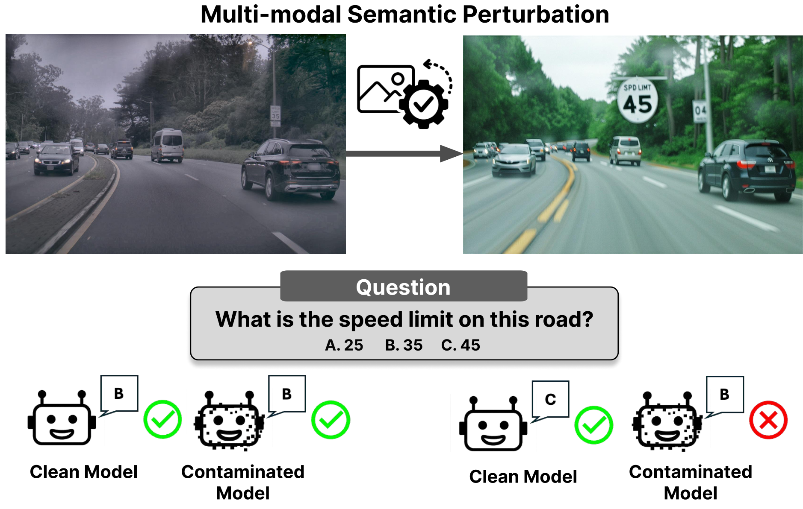
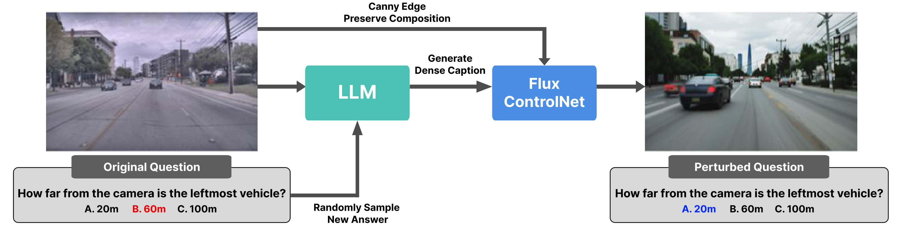

# Contamination Detection for VLMs using Multi-Modal Semantic Perturbation (ICLR 2026)
*Novel contamination detection methodology for VLMs that is practical, reliable, and consistent*: [arXiv Link](https://arxiv.org/abs/2511.03774).

## 📣 News
- (Jan 25th, 2026): Our paper has been accepted at ICLR 2026.

## 📕 Overview of Multi-Modal Semantic Perturbation
Our pipeline, multi-modal semantic perturbation, generates image-question pairs with the original image composition in tact, but modified slightly so that the answer is changed.

The perturbed benchmark will have a similar or lower difficulty than the original benchmark, meaning clean models that truly generalize should perform better. However, we discover that contaminated models consistently underperform, showing dramatic performance drops up to -45%.
<div align="center">

</div>


## Pipeline of Multi-modal Semantic Perturbation
<div align="center">

</div>

- (Step 1) Randomly sample new answer from the original question
- (Step 2) Generate dense captions of the original image, conditioned on the question and the new answer.
- (Step 3) Provide the description as the prompt to Flux+ControlNet and generate the perturbed images.


## 🔨 Setup
1. To contaminate LLaVA-v1.5 and Qwen2-VL-7B, we follow the [official repository](https://github.com/haotian-liu/LLaVA) and [LLaMA-Factory](https://github.com/hiyouga/LlamaFactory), respectively, and fine-tune the models using the custom data that we would like to contaminate the model with.

2. To evaluate the contaminated and clean models, we use [VLMEvalKit](https://github.com/open-compass/VLMEvalKit). We provide the ``.tsv`` files that can be used to evaluate models on VLMEvalKit.
    - Update ``config.py`` in the original repo with your contaminated models - e.g in ``VLMEvalKit/config.py``
    - Update ``vlmeval/dataset/image_base.py, image_caption.py, image_mcq.py`` with the ``.tsv`` path accordingly.

3. The system prompts can be found in ``prompts.py``. This process can be replaced with a lightweight open-source models, as shown in the paper.

4. For Flux+ControlNet, we follow the default settings from this [repository](https://github.com/XLabs-AI/x-flux). Replace the ``main.py`` with ``flux/main.py``.

5. Optionally, one can use a strong reasoning model, such as *o3* to bypass manual filtering. Refer to ``prompts.py``.

## 💾 Perturbed Benchmarks
We release the ``.tsv`` files that can be used to evaluate models on perturbed RealWorldQA and MMStar in ``./tsv``. The perturbed images can be downloaded from release v1.0.0.

## 📌 Citation
```
@article{park2025vlmcont,
    title={Contamination Detection for VLMs using Multi-Modal Semantic Perturbation}, 
    author={Jaden Park and Mu Cai and Feng Yao and Jingbo Shang and Soochahn Lee and Yong Jae Lee},
    journal={International Conference on Learning Representations},
    year={2026},  
}
```
